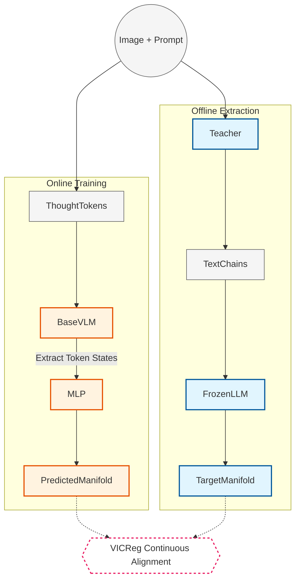

# **LatentEuclid: Non-Autoregressive Geometric Reasoning via Continuous Latent Topologies and VL-JEPA**

## **1. Abstract & Motivation**

State-of-the-art autoregressive Vision-Language Models (VLMs) demonstrate strong mathematical reasoning capabilities but suffer from severe computational bottlenecks and hallucination issues. Because they compress continuous 2D spatial relationships into 1D sequences of discrete tokens (the **"Translation Bottleneck"**), their autoregressive engine heavily attends to its own recently generated text during long Chain-of-Thought (CoT) sequences. This causes the model to suffer from **"Visual Forgetting,"** overriding grounded visual evidence with language priors. Existing latent-pathway models attempt to solve this but suffer from weak modality coordination, leaving latent usage up to an overriding autoregressive language engine.

Drawing on the Joint Embedding Predictive Architecture (VL-JEPA) paradigm, we introduce **LatentEuclid**, a single-shot (Macro-JEPA) architecture. By utilizing a frontier VLM as an "Expert Teacher" to construct a structured mathematical manifold, we train a compact VLM using continuous alignment to map raw visual inputs directly into this geometric latent space. Using parallel `<thought>` tokens, LatentEuclid bypasses the discrete text bottleneck entirely, arriving at a complex geometric thought in a single sequential forward pass.

## **2. Methodology & Architecture Pipeline**

### **Phase 1: Data Enrichment & The Frozen Target Manifold ($Y$-Encoder)**

* **Dataset:** Geometric reasoning datasets (GeoThought) consisting of an image and a short mathematical prompt (e.g., *"Find x"*).
* **Expert Teacher Pipeline:** We pass the dataset through a frontier API (Gemini 3 Flash Preview). The API is strictly prompted to output a structured reasoning chain with exactly $K=4$ steps: 1. Visual Parsing, 2. Theorem Retrieval, 3. Calculation, 4. Final Conclusion.
* **Target Manifold Creation:** To ensure the target space explicitly retains the arithmetic and syntactic nuances required for text generation, we use an LLM-native embedding space (such as Qwen3-0.6B) rather than generic semantic retrievers like BGE-m3. We pass each of the $K$ textual steps independently through this frozen textual model, extracting its final hidden states. For each problem, the ground-truth target is a sequence of $K$ dense, continuous vectors: $[S_{y1}, S_{y2}, S_{y3}, S_{y4}]$.

### **Phase 2: LatentEuclid Architecture ($X$-Encoder & Predictor)**

* **Base Model:** Qwen3-VL-4B-Instruct.
* **Latent Queries:** We inject $K$ new learnable special tokens into the tokenizer's vocabulary: `<thought_1>` to `<thought_4>`.
* **Causal Forward Pass:** The input sequence is formulated as `[Image Tokens] + [Question Tokens] + <thought_1>...<thought_4>`. Rather than forcing custom bidirectional masks that can destroy the pretrained weights' internal logic, we embrace the native causal mask. Mathematical logic is inherently sequential; allowing `<thought_2>` to attend to `<thought_1>`, but restricting it from seeing `<thought_3>`, accurately mirrors the temporal flow of a mathematical proof while still executing the entire structure in a single parallel forward pass.
* **Predictor MLP:** We extract the final-layer hidden states corresponding to the $K$ `<thought>` tokens. These states are passed through a custom 2-layer Predictor MLP to map them to the dimensionality of the $Y$-Encoder, yielding the predicted continuous reasoning steps: $[\hat{S}_{y1}, \hat{S}_{y2}, \hat{S}_{y3}, \hat{S}_{y4}]$.

### **Phase 3: Continuous Alignment (Training)**

* **Objective:** Map the VLM's visual latent representations to the frozen expert target manifold.
* **Loss Function (VICReg):** Distinct geometry problems often share identical intermediate steps (e.g., "The angles of a triangle sum to 180°"). Standard contrastive losses like InfoNCE treat these as "negative" pairs, unfairly penalizing the model and requiring destructively large batch sizes to prevent representation collapse. Instead, LatentEuclid bypasses InfoNCE entirely and uses **VICReg** (Variance-Invariance-Covariance Regularization), which stabilizes representations and prevents collapse without requiring negative pairs, making it highly efficient for continuous VLM training with geometry domains.

### **Phase 4: Decoding and Inference ($Y$-Decoder)**

* **Test-Time Execution:** During inference, the visual input, question, and `<thought>` tokens are passed through the network in one shot to yield the 4 latent vectors.
* **Soft Prompt Prefix Tuning:** The readout mechanism uses a highly lightweight Decoder matching the LLM-native embedding space used in Phase 1 (e.g., Qwen3-0.6B). We treat the 4 predicted vectors $[\hat{S}_{y1}, ..., \hat{S}_{y4}]$ as **Soft Prompts**. By linearly projecting the vectors to match the decoder's token embedding dimension, they are prepended directly to the decoder's embedding sequence. Conditioned natively on these continuous latent prefixes, the frozen decoder autoregressively generates the final short numerical string.

## **3. Evaluation & Probing Strategy**

To scientifically validate the VL-JEPA hypothesis, we execute a head-to-head comparison against a vanilla baseline fine-tuned on the same autoregressive CoT dataset.

1. **The Grounding Claim (Pre-Generation Probing):** 
   * *Baseline Vector:* We extract the "Pre-Generation" hidden state from the baseline VLM (the vector of the `<start_of_answer>` token immediately before autoregressive CoT begins).
   * *LatentEuclid Vector:* We utilize the predicted target embeddings ($\hat{S}_{Y}$).
   * *Task:* We train identical linear probes on both sets of vectors to predict intermediate geometric relations explicitly listed in Step 1 (e.g., "Are lines AB and CD parallel?"). If the baseline VLM probe fails but LatentEuclid succeeds, it empirically validates that the baseline never grounded the spatial geometry topologically prior to generating text.
2. **Progressive Temporal Probing:** Expanding the probing experiment across the sequence, we train linear probes on `<thought_1>`, `<thought_2>`, `<thought_3>`, and `<thought_4>` separately. Low-level visual features (e.g., "parallel lines detected") peak in accuracy at `<thought_1>`, while high-level abstractions (e.g., "x = 45") peak at `<thought_4>`. This provides irrefutable evidence that LatentEuclid successfully structures a sequential chain of thought purely in a continuous latent space.
3. **Efficiency Analysis (The Latency Claim):** We measure FLOPs and inference latency (Time-to-Answer), contrasting LatentEuclid (1 heavy sequential forward pass + 1 microscopic decoder pass) against a standard structured VLM (upwards of 150+ expensive autoregressive decoding passes through the massive multimodal backbone).
4. **End-to-End Accuracy:** We benchmark the final structured mathematical accuracy against the baseline models.
